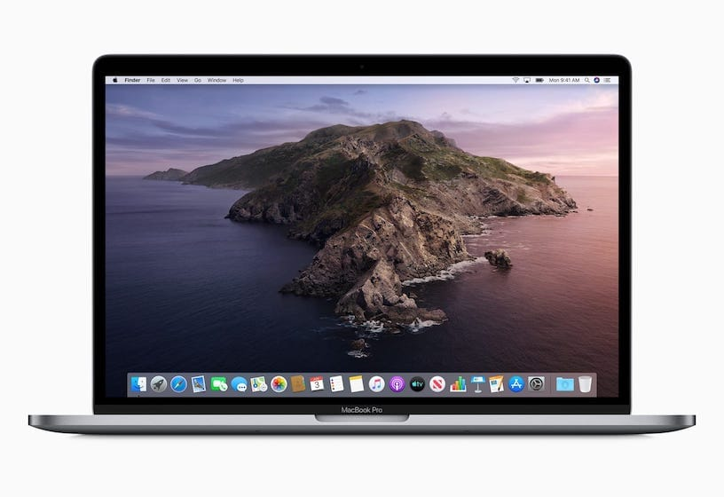

## Catalina



這一段是對 macOS Catalina 的抱怨，要看安裝過程請直接跳到下一段。

我的 MacBook Pro 是 2018 年底生產的機器，出廠時搭配的是 High Sierra，幾個月後升級成 Mojave，持續到 2019 年都沒有問題。

2019 年發佈 macOS Catalina，作業系統架構變動甚大，還破紀錄在短時間內發佈數個更新檔，可是作業系統仍然問題頻傳。

我在第一時間嘗鮮就從 Mojave 直接升級到 Catalina，但不幸中了幾個非常嚴重的問題，電腦在使用過程中有時會突然風扇狂轉，就算關掉所有應用程式還停不下來。

電腦進入睡眠模式喚醒後，就卡在登入畫面，游標變成旋轉的彩球，風扇也突然的快速轉了起來，除了強制關機沒有解決方法。

這二個問題讓我非常困擾，是以前沒有遇到的經驗，過往蘋果的軟體品質讓我很放心，這次可能為了要和 iOS 及 iPadOS 整合而更改系統架構，所以和舊的程式不相容，與其等待蘋果發佈更新，不如重新安裝作業系統來得快，幸好平時已經使用一些雲端服務在儲存重要的資料，也就沒有做 Time Machine 備份的必要，所以決定來個 clean install。

因為重新安裝這個動作並非常常做，於是把每個軟體為什麼要安裝，以及軟體設定的內容記下來，以免之後再安裝或者改設定時想不起來。

## 安裝 Xcode command line tools


為了讓電腦裡的終端機能執行一些開發的指令，我們要先安裝 Xcode command line tools，這個工具在安裝 Xcode 的時候會同時安裝。

假如因為硬碟空間有限不想裝 Xcode，也可以獨立安裝 Xcode command line tools。到 [Apple Developer](https://developer.apple.com/download/more/) 的下載網頁，用你的 Apple ID 登入，在 More 頁面用日期排序，找到最新發佈的 Xcode command line tools 進行下載。可以發現檔案大小比起 Xcode 差別相當大，確定不需要 Xcode 的話，就可以只單獨下載 Xcode command line tools。但是要注意它不會自動更新，在發現 Xcode 新版本發佈時記得自己回來下載新版的。


Xcode 更新版可以在 Mac App Store 取得，command line tools 會同時一併更新。

## 安裝 Git

macOS 自帶蘋果自己 [fork](https://opensource.apple.com/source/Git/) 版本的 Git，在全新的 macOS terminal app 打 `git --version` 會跑出版本號，和 Git 官網比對會發現，這個版本落後官方版很多。

我們當然要用最新版的。安裝 Git 有許多方法，這裡介紹常用的二種。

### 從 Git 官網安裝


第一種最簡單，到 [Git 官網](https://git-scm.com/downloads)下載自動安裝程式，照著指示安裝就可以了。

有些人偏好直接從[原始檔](https://github.com/git/git/)安裝，會比自動安裝程式快幾個 release，等不及官方打包成安裝程式可以使用這個。

### 用 Homebrew 安裝


第二種是安裝 [Homebrew](https://brew.sh) 後，用它來管理作業系統裡的套件，再來安裝 Git。

先去 Homebrew 官網裝好 Homebrew 後，檢查是否為最新版。

```shell
brew doctor
brew update
```

確定都是最新後才安裝 Git。

```shell
brew install git
```

以上二種方法在安裝完成後重啟 terminal，再用 `git --version` 檢查是否為新版本。

## 安裝 NVM

現在的前端開發都會用到 Node.js，不過在安裝之前先裝一個管理 Node 版本的工具 Node Version Manager 簡稱 NVM。

為什麼呢？因為 Node.js 開發速度很快，基於某些版本開發的應用可能換個版本就不能用了，所以要使用 NVM 下載不同版本的 Node，根據專案的需要切換專案可以運行的版本。

到 NVM 官方 repo 去，複製一串 install script 貼到你的 terminal app 裡執行，NVM 就會安裝好了。

[https://github.com/creationix/nvm](https://github.com/creationix/nvm)

```shell
curl -o- https://raw.githubusercontent.com/nvm-sh/nvm/v0.35.1/install.sh | bash
```

這會在 home directory 裡建立隱藏的 `~/.nvm` 檔案目錄。

分享一個 macOS 小技巧，平常 macOS 不會顯示隱藏的檔案及目錄，這時在 Finder 裡按 `cmd + shift + .` 就可以切換隱藏資料的顯示及隱藏，隱藏的資料名字前面會有`.`而且顏色比較淡。

確認 NVM 有正確安裝。

```shell
command -v nvm
```

有回傳 `nvm` 就表示安裝成功。

如果要刪除 NVM 只要把 `~/.nvm` 目錄刪除就可以。

如果在 NVM 安裝過程中失敗了，有可能是因為你的 home directory 裡沒有 `~/.bashrc` 或是 `~/.zshrc` 檔案。Install script 需要寫入一些指令到裡面，如果你的電腦沒有這些檔案 NVM install script 就會失效。

因為我的終端環境是 Zsh 所以要新增 Zsh 的設定檔 `~/.zshrc`。

```shell
touch ~/.zshrc
```

再跑一次 install script 應該就安裝成功了，然後重開 terminal。

## 安裝 Node.js

用 NVM 安裝最新版本 Node。

```shell
nvm install node
```

用 NVM 安裝 LTS 版本 Node。

```shell
nvm install --lts
```

### Node.js 版本解釋


到 Node.js 官網會看到下載的地方有二個版本的按鈕，什麼是 LTS？什麼又是 current？我該下載哪一個呢？而上面那個指令給我安裝的又是哪一個版本？它們有什麼差別？

這裡解釋一下 Node.js 的開發流程，為了兼顧開發及運用雙方的需求，每個版本的 Node.js 會經歷幾個開發時期。


（Node.js 開發時程表。來源：[Node.js 官網](https://nodejs.org/en/about/releases/)）

首先是 Current 時期，在這個時候會大量加入新功能，讓一些基於 Node.js 的程式庫開發能趕上更新。

Current 時期會持續 6 個月，結束後啟動下一個版本號的 Current 開發，如上面的時程表，12 的 Current 結束後接著 13 的 Current，然後又接 14。同時原本的版本號進入 18 個月的 Active LTS 時期。LTS 是 long-term support 的縮寫，這個時候主要工作在除錯，讓程式更穩定，不會再加入新的功能。

再接下來的 12 個月就進入 Maintainance LTS 時期，這個時候重大的錯誤應該都除完了，只剩下修複一些小 bug。

30 個月（6+18+12）過後這個版本已經到了生命末期，不會再有維護及更新，即將被淘汰。

還有一個要注意的是，單數版本的 Node.js 在 Current 時期結束後直接被淘汰，不會經歷 LTS，直接開始下一個雙數版本的 Current 開發。雙數版本會經歷完整的開發及維護週期，長達三年，這也是為什麼 LTS 都是雙數版本的原因。從上面的時程表可以看到版本 13 和版本 12 及 14 的差別在於 13 只有 Current 時期。

那麼要怎麼選擇呢？如果是商業上 production 的專案，選擇 LTS 版本，最長有 30 個月的穩定維護時間，在網頁應用上非常足夠。如果是個人的 side project 就可以用 Current 版本，享受最新功能帶來的便利。

然而也是因為較長的 LTS 時間，在同一時刻會有許多 LTS 版本，有些才剛開始維護期，有些即將進入尾聲，要選擇哪一個則要依你的專案來判斷。

參考資料：

- [Releases | Node.js](https://nodejs.org/en/about/releases/)
- [Understanding How Node.js Release Lines Work - NodeSource](https://nodesource.com/blog/understanding-how-node-js-release-lines-work/)

### NVM 常用指令

檢查已經安裝的 Node 版本。

```shell
nvm ls
```

檢查已發佈的 Node 版本。

```shell
nvm ls-remote
```

安裝指定版本。

```shell
nvm install vX.X.X
nvm install v13.0.1
```

移除指定版本。

```shell
nvm uninstall vX.X.X
nvm uninstall v13.0.1
```

顯示 NVM 指令。

```shell
nvm --help
```

如果版本號太長不好記，NVM 可以為指定的版本取一個別名 alias，之後在任何輸入版本號的地方，都可以用別名代替。

```shell
nvm alias [alias name] X.X.X
nvm alias my-project v13.0.1
```

特別注意 `default` 別名是特殊的別名，指定為 `default` 的版本會是終端環境預設的版本，也就是說新開 terminal 時會使用的版本號。

指定使用已安裝的版本。

```shell
nvm use vX.X.X
nvm use v13.0.1
```

除了用版本號指定，也可以用 alias 指定。

```shell
nvm use default
nvm use my-project
```

參考資料：

- [NVM Usage](https://github.com/nvm-sh/nvm/blob/master/README.md#usage)

### Node 的安裝位置

安裝了 Node 後，NVM 會在 `~/.nvm` 下新增 `/versions/node/vX.X.X` 目錄。


Node.js 也可以在官網下載安裝檔執行自動安裝，或者用 Homebrew 安裝。不同方法會安裝在不同的檔案目錄下。而不同安裝方式的 Node.js 可以並存在同一台主機，要使用哪一種則是看你的`~/.zshrc`（或`~/.bashrc`）裡面的`exp NVM_DIR`目標而定。

參考資料：

- [Could someone please help me FIND node.js on my computer? and.. · Issue #915 · nodejs/help · GitHub](https://github.com/nodejs/help/issues/915)

## 安裝 Oh My Zsh

macOS 終端機的預設環境一直都是 [Bash](https://zh.wikipedia.org/zh-tw/Bash)，從 10.15 Catalina 開始改成 [Zsh](https://zh.wikipedia.org/zh-tw/Z_shell)，使用上是沒有差別，不過 Zsh 有個框架 [Oh My Zsh](https://github.com/robbyrussell/oh-my-zsh) 可以讓我們的終端機外觀更好看，顯示功能更強大。


（macOS 的 Zsh）

安裝方式很簡單，在 terminal app 貼上一行 curl 指令。

```shell
sh -c “$(curl -fsSL https://raw.githubusercontent.com/robbyrussell/oh-my-zsh/master/tools/install.sh)”
```


（安裝了 Oh My Zsh）

重啟 terminal app，發現 command prompt 位置變了，符號被上了色彩，這是 Oh My Zsh 預設的 Robbyrussell 主題，我們來換一個。

在 home directory 裡找到隱藏檔 `.zshrc` 用文字編輯器打開它，這裡是 Zsh 環境的設定，以及在全域可以使用的指令。

找到 `ZSH_THEME` 這行，將預設的 `robbyrussell` 主題名稱改成 `agnoster`，存檔並重啟 terminal app。


（Agnoster 主題）

畫面多了奇怪的符號，這是因為 Agnoster 主題使用特殊的符號，電腦缺少對應的字體。

## 安裝 Powerline 字體

我們要先下載整個 [Powerline fonts repo](https://github.com/powerline/fonts) 到本機，然後執行裡面的自動安裝腳本，裝好後再刪除這個 repo。

```shell
# 複製整個 repo 到本機端
git clone https://github.com/powerline/fonts.git --depth=1
# 進入下載的資料夾
cd fonts
# 執行自動安裝字體腳本
./install.sh
# 回到上一層
cd ..
# 刪除資料夾
rm -rf fonts
```

現在打開 Font Book app 會在 user 類別裡多了許多新字體，完整字體清單可以參考官方 GitHub readme。


接下來打開 terminal app，在 `Preference > Profile > Text > Font` 按右邊的按鈕，選擇一個剛才安裝的字體，以及適合的字體大小，我是用 Fira Mono for Powerline Regular 14px。


回來 terminal app，剛才亂碼的地方現在成為漂亮的箭頭，變得比較好看了！

## 隱藏 user@hostname 提示

現在每個輸入行前面都有一長串的 `user@hostname` 的提示字元，我這裡是 `yowlonglee@Yow-Longs-MacBook-Pro-15`，實在佔螢幕空間。這是 Agnoster 主題的 `prompt_context` 功能，在 command prompt 顯示目前登入的帳號與主機名稱。然而當我們是在自己的機器上開發時，這串訊息就顯得多餘。

在 `~/.oh-my-zsh/themes/agnoster.zsh-theme` 裡有 Agnoster 主題的設定，找到 `prompt_context()` 這段函式：

```shell
# Context: user@hostname (who am I and where am I)
prompt_context() {
  if [[ “$USER” != “$DEFAULT_USER” || -n “$SSH_CLIENT” ]]; then
    prompt_segment black default “%(!.%.)%n@%m”
  fi
}
```

當 `$USER` 和 `$DEFAULT_USER` 的值不相等時就會顯示這個提示，而 Agnoster 主題 `$DEFAULT_USER` 預設是空值，因此只要在設定檔任一個地方把 `DEFAULT_USER` 加上你的使用者名稱讓 `$USER` 和 `$DEFAULT_USER` 二個值一樣就能隱藏這個提示。

使用者名稱是你 macOS 登入的帳號，或者在 command line 輸入 `whoami` 也可以查得到，我的使用者名稱是 `yowlonglee`。

```shell
# ~/.zshrc
DEFAULT_USER=“yowlonglee”
```


存檔後重啟 terminal，之前礙眼的文字都消失了，畫面是不是既乾淨又清爽呢？

Oh My Zsh 自帶許多主題，Robbyrussell 和 Agnoster 是其中二個，完整清單在[這裡](https://github.com/robbyrussell/oh-my-zsh/wiki/Themes)，主題的檔案在 `~/.oh-my-zsh/themes/` 裡面。要使用裡面沒有的主題則要另外安裝，例如另一個熱門的強大主題 [Powerlevel9k](https://github.com/Powerlevel9k/powerlevel9k)，請參考 readme 裡的安裝方法。

## iTerm2


要進一步變更終端環境的外觀，建議下載 [iTerm2](https://iterm2.com)，它在設定上面比起原生 terminal app 來得方便。以設定文字顏色來說好了，terminal app 只能用 macOS 原生的色彩選擇介面，我覺得相當難用。而 iTerm2 可以輸入 HEX color codes 對工程師比較友善，而且網路上更有許多精美的主題能下載套用。


到 iTerm2 的設定 `Profile > Colors`，在 `Color Presets` 分類選擇 `Import` 匯入下載的主題，之後就可以選擇任一個已匯入的主題。

分享幾個不錯的主題來源：

- [iTerm2 themes](https://iterm2colorschemes.com)
- [Dracula — A dark theme for iTerm and 50+ apps](https://draculatheme.com/iterm/)
- [NightOwl](https://github.com/sdras/night-owl-vscode-theme)

我用的是 NightOwl，它同時也有 VSCode 用的主題。

## 開啟 Ligature


再一次進入 iTerm2 的設定`Profile > Text`，在 `Font` 分類下有個` Use ligatures` 的項目，將它打勾。

Ligatures（連字）的作用是將一些用鍵盤打不出來而被迫拆開的運算符號轉換成原本的樣子，便於閱讀，例如當你輸入`!=`的時候，會自動變成`≠`。


這種效果需要字體支援 ligatures，前面我們選擇的 Fira Mono 一開始是 Mozilla 主推的字體，適用在展示程式碼，有網友根據它設計了 [Fira Code](https://github.com/tonsky/FiraCode) 字體，進一步支援 ligatures 和 Powerline。

下載安裝後，在 iTerm 的字型設定裡選擇 Fira Code Retina 14px，如果你的電腦不是高解析度螢幕，就使用 Regular 版本。

一個字體有沒有支援 ligatures 在字體範例裡都可以找得到，如果沒有可能是不支援。

Oh My Zsh 擁有豐富的 plugin 體系，我才剛安裝，不太熟悉新環境，就介紹到這裡。如果你有其他更有趣的應用，歡迎留言跟大家分享。

## 安裝 Vue CLI

將 [Vue CLI](https://cli.vuejs.org/) 安裝在全域環境。

```shell
npm install -g @vue/cli
```

開啟一個新 Vue 專案。

```shell
vue create my-project
```

或是用 GUI 介面。

```shell
vue ui
```

簡單！

## Create React App

之前建立 React 專案時也是要先全域安裝 Create React App，現在 React 官網[建議](https://create-react-app.dev/docs/getting-started/)使用新的 `npx` 指令，所以如果之前你有裝過 Create React App，現在可以刪除它 `npm uninstall -g create-react-app`。

創建新的 React 專案：

```shell
npx create-react-app my-project
cd my-project
npm start
```

`npx`指令在 npm 5.2 版本開始內建，它的功能是在呼叫指令時（如`create-react-app`），會先到本機已安裝的 node modules 裡面找，沒有找到則會上網去下載這個套件到暫存位置，執行完後刪除。好處是開發者不用再煩惱使用套件的前置作業（例如套件要裝在 global 或者 dependancy），使用`npx`一切即時做到好，馬上可以開始開發。

以前要先全域安裝 create react app 工具要下比較多的指令。

```shell
npm install -g create-react-app
create-react-app my-project
cd my-project
npm start
```

到這裡電腦已經可以開發大部份的前端專案了，剩下就是安裝文字編輯器及瀏覽器，還有各種小工具幫助開發，這些留給之後的文章吧。
